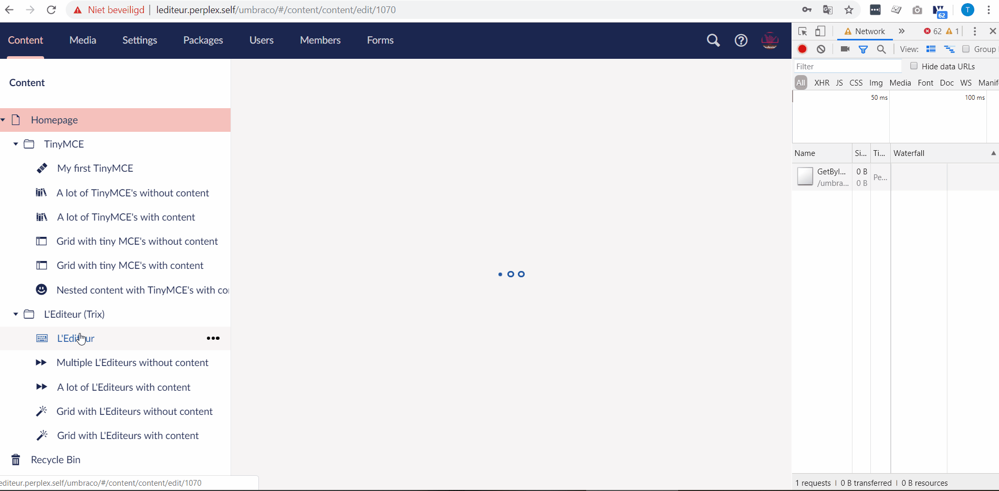
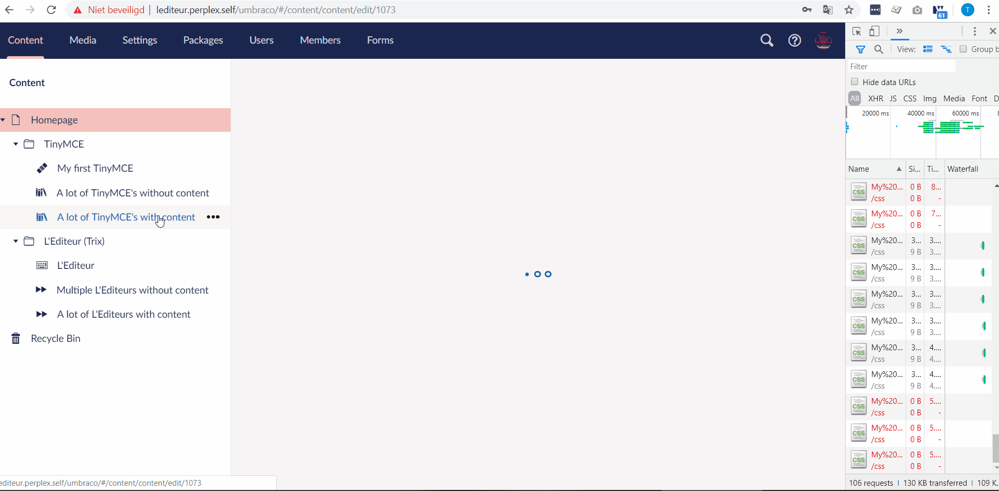
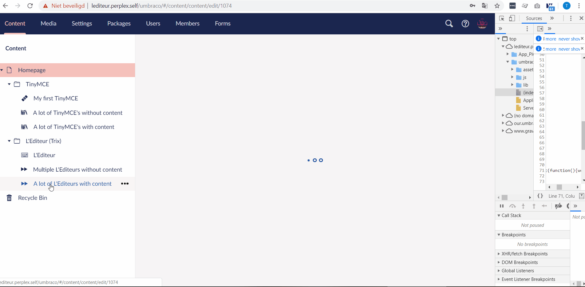

# Project L'Éditeur

Request for Contribution (RFC) 0000 : _Simpler and Faster Rich Text Editor_

## Code of conduct

Please read and respect the [RFC Code of Conduct](https://github.com/umbraco/rfcs/blob/master/CODE_OF_CONDUCT.md)

## Intended Audience 

The intended audience for Project L'Éditeur is two fold:
* Content creators, editors and other people who use the rich text editor on a daily basis
* Back Office developers who can help implement, improve and extend the rich text editor

## Summary

We would like to replace the current TinyMCE based editor with something simpler and faster, that focus on basic content creation.

We would like for the new editor to be able to support a faster workflow for content creators while knowing that they likely create their drafts outside the CMS and then copy their text into the editor.

We would like the new editor to automatically import photos that are dragged or copied into the editor as Media items without the editor needing to do anything.

We don't want the editor to be a page builder, grid or in other ways an editor for advanced landing pages, but we want to enable that the editor can be used as a part of a page builder.

We believe that the [Trix-editor by Basecamp](https://trix-editor.org/) ticks most boxes and should be used as the foundation for L'Éditeur.

## Motivation

Umbraco's mission is about _helping you deliver delightful digital experiences by making Umbraco friendly, simpler and social_. While we believe that Umbraco has one best editor experiences for a generic cms, we do believe that for core content editing we can do better.

We've been impressed with the content creation experiences of [Medium](https://yabwe.github.io/medium-editor/demo.html) and we've been researching and comparing how to create different types of content in different ways in Umbraco. From the Rich Text Editor, to the Grid to using 3rd party packages.

We believe that the current solutions provided in Umbraco are either too basic or too advanced and there's room for a modern and focused Rich Text Editor that is faster and less bloated than the current TinyMCE based one and where the focus for the features should be centered around improving the workflow and speed of content creators.

The outcome of this project will be a new editor that's fast, supports elements that are considered basic part of modern content such as Photos, Quotes, Formatting, Embeds of both Video and Social. For content more advanced than that, we believe L'Éditeur can be used as a part of block based editors rather than trying to solve that on its own.

## Detailed Design

We'll base Project L'Éditeur on the Trix editor by Basecamp. It serves our purpose and ticks almost all our boxes for a modern rich text editor for Umbraco:
* ✅ Fast and Javascript based with no usage of iFrames
* ✅ Outputs clean and accessible markup
* ✅ Basic RTE features such as bold, italic
* ✅ Great concept of "Attachments" for items to be included in RTE but not be editable (such as embeds, macros and photos)
* ✅ Great support for copy/paste including detecting dragged/copied images
* ✅ Configurable and easy to style
* ✅ Easy to extend
* ✅ Support for bringing custom formats
* ✅ Support for multiple instances on the same document (including Nested Content / Grid)
* ✅ Trix Editor is an open-source project (MIT licensed), [actively developed](https://github.com/basecamp/trix/graphs/code-frequency), issues are being resolved and in use for Basecamp.

We have the current prioritization for features:
1. Basic formatting (bold, italic, unordered and ordered lists)
1. Pick internal and external links
1. Custom formatting based on own styles
1. Copy/paste or dragging images should create them as media items and relate to the page (smart copy/paste)
1. Style the editor to match Umbraco UX styles
1. Documentation about the configuration and extensibility of the editor 
1. Research the accessibility of the editor itself, and the output of the editor

2. Custom (and configurable) image formatting (Medium.com editor style)
2. Support for embedding videos and tweets (and turn it into correct markup)

3. Support for custom html snippets (such as inserting pre-styled Call To Action buttons)
3. Support for inserting Umbraco Macros
3. Table editor

We have a working prototype of Trix editor working as an RTE inside of Umbraco and it's significantly faster. We'll update this RFC with performance comparisons.

A criteria for this project is also an editor experience that results in less "flicker" in the back office as editors and content loads, so the interface will appear more calm.

### Performance

For a comparison we've made a short screencap of a throttled slow 3G connection and load a page with a single editor and also an example with either 10 TinyMCE-editors or 10 L'Éditeur-editeurs. Each of the editors contain the same content.

A page with a TinyMCE on one page:

A page with a L'Editeur on one page:

A page with 10 TinyMCE's on one page:

A page with 10 L'Editeurs on one page:

The difference between the loading times are really big. A page with 10 L'Editeurs only creates 5 requests (2 requests in total for all L'Editeur datatypes) and is directly rendered. A page with 10 TinyMCE's creates 33 requests (3 requests per datatype). The reason is that TinyMCE instantiates a new iframe for each editor and each editor makes three requests (a css-file, a stylesheet and another request (umbraco/backoffice/UmbracoApi/Stylesheet/GetRulesByName?name=). L'editeur only loads once; one stylesheet and one javascript file.

Even with just one editor - a obviously more common scenario - the difference is huge.

## Drawbacks

While L'Éditeur will bring many benefits to the editors, there's also features that will be missing such as editing tables. We believe that this can be solved later and that in the interim the TinyMCE based RTE will still exist.

A small drawback is that the Trix editor is built with Coffeescript. If we need to edit core concepts of the Trix editor, that might be a risk.

## Alternatives

We could look into simplifying and optimizing the load times and resources of TinyMCE. However, unfortunately it looks like the direction taken by TinyMCE is to make it more advanced which is great and impressive, but makes it less suitable for how an RTE is used in Umbraco.

We've been researching and testing a number of open and closed sourced RTEs, including:
* https://voog.github.io/wysihtml/
* https://neilj.github.io/Squire/
* https://www.froala.com
* https://www.slatejs.org
* https://yabwe.github.io/medium-editor/demo.html
* https://textbox.io/
* https://summernote.org/
* https://gist.github.com/abauzac/bf4969a521cce232c812f1c24ef549ec
* https://wordpress.org/gutenberg/

## Out of Scope

To discuss what editor should power Project L'Éditeur. We've settled on Trix and believes it serves the purpose.

## Unresolved Issues

The answers that we are hoping to get from the community HQ is:

* What do you think is the most important tasks to improve Content Creation efficiency and delightfulness for a Rich Text Editor?
* Have you any experience with the Trix-editor (good and bad)?
* What features of an RTE have we overlooked?

## Related RFCs (where are we in roadmap?)

The project L'Éditeur is complimented by the "New Block Editor" project

## Contributors

This RFC was compiled by:

* Jeffrey Schoemaker, Perplex (community) 
* Antoine Giraud, Novicell (community)
* Niels Hartvig, Umbraco (HQ)
* Umbraco Retreat members 2019
