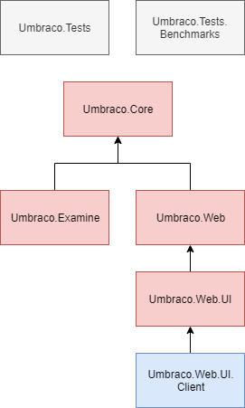
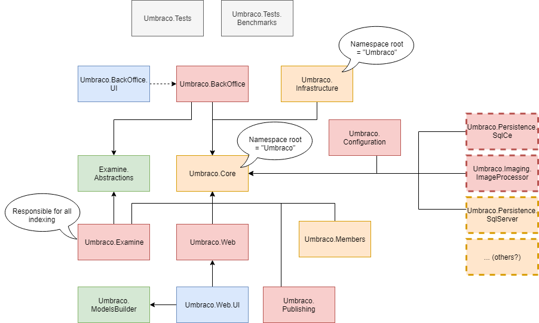

> Organize your life around your dreams and watch them come true

# Project UniCore - Project Structure 🦄

Request for Contribution (RFC) 2 : _Project and Solution re-structure_

## Code of conduct

Please read and respect the [RFC Code of Conduct](https://github.com/umbraco/rfcs/blob/master/CODE_OF_CONDUCT.md)

## Intended Audience

The intended audience for this RFC is technical users and developers.

## Summary

This RFC is a child of [Project UniCore - Introduction & Strategy](https://github.com/umbraco/rfcs/blob/master/cms/0001-project-unicore-intro.md)

We plan to re-organize the .Net solution/project structure and the resulting Nuget packages for the Umbraco CMS. This is a __Phase 1__ requirement of moving to .NET Core. The task of changing the project structure is only a stepping stone to migrating to .NET Core. We do not plan on releasing an Umbraco version purely based on this restructure. Ensure to see the RFC for [Project UniCore - Introduction & Strategy](https://github.com/umbraco/rfcs/blob/master/cms/0001-project-unicore-intro.md), this RFC is referring to the first phase of that strategy (Project Structure) in the [Critical path diagram](https://github.com/umbraco/rfcs/blob/master/cms/0001-project-unicore-intro.md#critical-path-diagram).

## Motivation

The main reasons for this are:

* Allows for easier transitioning from .Net Framework to .Net Core - without splitting the projects out into their logical parts, it will be near impossible to abstract out the implementation logic that requires full .NET Framework vs .NET Standard packages. 
* Allows for a better developer experience by being able to import only the Nuget packages required for your project.
* Allows for a cleaner architecture for the Umbraco codebase.
* Better naming conventions for projects, packages and namespaces.
* Easier to develop against and contribute to - it was necessary to move from a lot of smaller projects from v7 into 2 large projects (Umbraco.Core and Umbraco.Web) in v8 because it was much easier/faster to consolidate everything that wasn't legacy into fewer projects and then to trim off the legacy parts. Now that we have a project and code structure that makes sense and we no longer have a lot of smaller legacy projects, we can take the next step of re-splitting out the logical parts into separate projects. Developing against smaller separate projects means it is much easier to find and test aspects of the code.

## Detailed Design

We plan to do this Phase 1 project split but making the least amount of changes possible with the actual Umbraco code. Of course some changes will be required since we will need to create new abstractions and implementations for those as we split out the projects but we don't plan on making any larger architectural changes during this split. 

We also are going to ensure that all changes along the way mean the solution always builds and that the application always works and tests are passing. We don't want to get into a state where we've moved a ton of code around and the solution doesn't compile while we spend significant amounts of time working towards getting it built and working again. This means each change will be small iterations.

### Legend

*    Red: It is a .Net Framework project
*    Blue: It is a project containing static files only
*    Grey: Projects that don't affect any HQ build outputs
*    Yellow: it is a candidate .Net Standard project
*    Green: External dependencies that are primary features of the CMS
*   --Dashed--: Candidate projects that produce an interchangable and/or environment specific implementation of a dependency (OS, .Net platform)

### Current structure

#### Umbraco.Core

A large project containing many abstractions along with the entire data access layer including all dependencies for all supported database providers. This project has several external 3rd party dependencies.

Produces Nuget package `UmbracoCms.Core`

We would like to split this project out into several smaller projects and packages. (See below)

#### Umbraco.Web

A large project containing some abstractions for both "Web" and "Core", meaning that many of the abstractions listed in this project should exist higher up in the dependency graph (i.e. in Umbraco.Core). This projects also contains several implementations for items that should exist higher up in the dependency graph (i.e. Property editor configuration classes)

Produces Nuget package `UmbracoCms.Web`

We would like to split this project out into several smaller projects and packages. (See below)

#### Umbraco.Web.UI

A web application project that contains some razor files, folders and configuration files. Currently we also have one very old webforms file here too. This project produces a DLL however there is no real compilable code in the project therefore producing an unecessary DLL. This is the project that imports the ModelsBuilder reference.

Produces Nuget package `UmbracoCms`

We would like to remove the remaining webforms, and resulting DLL thus resulting in a non-building project (i.e. folder project)

### Proposed structure

#### Umbraco.Core

* This project will have no external 3rd party dependencies. 
* Provides all of the abstractions and implementations (which have no dependencies) for the business logic of the Umbraco Cms
* Is the implementation for the Umbraco Services (i.e. ContentService)
* The namespaces in this project will be rooted to "Umbraco" (i.e. will not be prefixed with the project name)

Produces Nuget package `UmbracoCms.Core`

#### Umbraco.Infrastructure

* This project is the implementation details for the persistence layer (i.e. umbraco repositories, npoco) therefore it has dependencies 
* Contains all of the Property Editor implementations and property value converters (that are not needed in a web context)
* Logging implementations
* Dependency Injection implementation
* The namespaces in this project will be rooted to "Umbraco" (i.e. will not be prefixed with the project name)

_NOTE: The name of this project, assembly and Nuget package is not absolute - meaning we may determine a better name in the future but for now this naming convention follows the [Clean Architecture](https://dotnet.microsoft.com/download/thank-you/aspnet-ebook) conventions_

Produces Nuget package `UmbracoCms.Infrastructure`

#### Umbraco.Configuration

* Will contain the configuration implementation
* Currently flagged as .Net Framework for the initial phase of splitting out projects. In the 2nd phase of porting to .Net Core we will migrate this project to use the .Net Standard style configuration implementation which will be a future RFC.

Produces Nuget package `UmbracoCms.Configuration`

#### Umbraco.Members

* Will contain all of the logic for dealing with Umbraco members
* For the initial phase of splitting out projects all membership logic will be removed from the solution because members are based on the legacy membershipprovider technology which cannot be used in .Net Standard. During this phase this project will remain empty (not included in the solution).
* Membership needs to be rewritten in ASP.Net Identity and this project will contain all of that logic (that is not part of this RFC, it will be a future project).

Produces Nuget package `UmbracoCms.Members`

#### Umbraco.BackOffice

* Will contain all of the web based implementation for running the Umbraco backoffice such as MVC Controllers, ASP.Net Identity implementation for Users and Authentication/Authorization policies for the backoffice
* Contains the models to support the backoffice and controllers

Produces Nuget package `UmbracoCms.BackOffice`

#### Umbraco.BackOffice.UI

* Contains the client files used to build/run the backoffice

Produces Nuget package `UmbracoCms.BackOffice.UI`

#### Umbraco.Web

* Contains the routing logic for front-end pages
* Web implementation for running the front-end including some MVC controllers, filters, etc...
* Helper & extension classes used for rendering front end templates
* Contains some property value converters that are web specific (i.e. may return IHtmlString which is a web structure)

Produces Nuget package `UmbracoCms.Web`

#### Umbraco.Web.UI

* Contains the configuration files that are shipped with the main Nuget project
* Contains some razor views that are shipped with the front end (i.e. grid views)

Produces Nuget package `UmbracoCms.Web.UI`

#### Umbraco.Publishing

* Contains the implementation for storing and querying published content

Produces Nuget package `UmbracoCms.Publishing`

#### Umbraco.Examine

* Contains the implementation of Examine indexing for Umbraco
* Contains all of the event handling to populate indexes

Produces Nuget package `UmbracoCms.Examine`

#### Umbraco.Persistence.SqlCe

* Contains the implementation of the database dialect and provider for SqlCe
* This will remain a .Net Framework assembly since it will only work on Windows

Produces Nuget package `UmbracoCms.Persistence.SqlCe`

#### Umbraco.Persistence.SqlServer

* Contains the implementation of the database dialect and provider for Sql server

Produces Nuget package `UmbracoCms.Persistence.SqlServer`

#### Umbraco.Imaging.ImageProcessor

* Contains the implementation of the imaging requirements for umbraco using Image Processor
* This will remain a .Net Framework assembly since it will only work on Windows

Produces Nuget package `UmbracoCms.Imaging.ImageProcessor`

## Drawbacks

* Breaking changes due to different Nuget packages made available, but as this is Phase 1 to migrating to .NET Core and we don't plan on releasing a version purely based on a project restructure we shouldn't be concerned about breaking changes since there will be plenty with the release of Umbraco running on .NET Core anyways. 
* Namespace changes in the Umbraco solution will be made. Although this is a breaking change we feel that this is overcome by a textual find + replace. 

## Alternatives

It may be possible to move from .Net Framework to .Net Core with the current solution/project structure, however this would result in:

* Since some dependencies are only .Net Framework (such as SQLCE) it would require multiple pre-processor directives throughout the codebase and cross compilation which makes the codebase more difficult to support, manage and contribute to.
* Much lengthier time frames to reach .Net Core due to the complexity involved in migrating very large projects at one time instead of multiple smaller projects over time.
* Lessens community involvement because without proper project separation the community would need to wait until large parts of the codebase are fully ported over instead of only waiting for smaller portions to be ported over. 

## Out of Scope

The change from .Net Framework to .Net Core is out of scope of this discussion, 
that RFC is found in the parent RFC [Project UniCore - Introduction & Strategy]().

Any codebase design changes is out of the scope of this discussion. This RFC is only about solution, project, namespace and output Nuget package restructure.

## Related RFCs (where are we in roadmap?)

*   [RFC - Introduction & Strategy](https://github.com/umbraco/rfcs/blob/master/cms/0001-project-unicore-intro.md)
    *   __RFC - Project/solution restructure__
    *   RFC - Database abstraction
    *   RFC - Imaging abstraction
    *   RFC - Configuration
    *   RFC - .Net Core Version choice
    *   RFC - Microsoft DI transition
    *   RFC - Linux / Docker

## Contributors

This RFC was compiled by:

*   Shannon Deminick (Umbraco HQ)
*   Carole Logan (Umbraco Community)
*   Lars-Erik Aabech (Umbraco Community)
*   Stéphane Gay (Umbraco HQ)
*   Bjarke Berg (Umbraco HQ)
*   Umbraco 2019 Retreat members