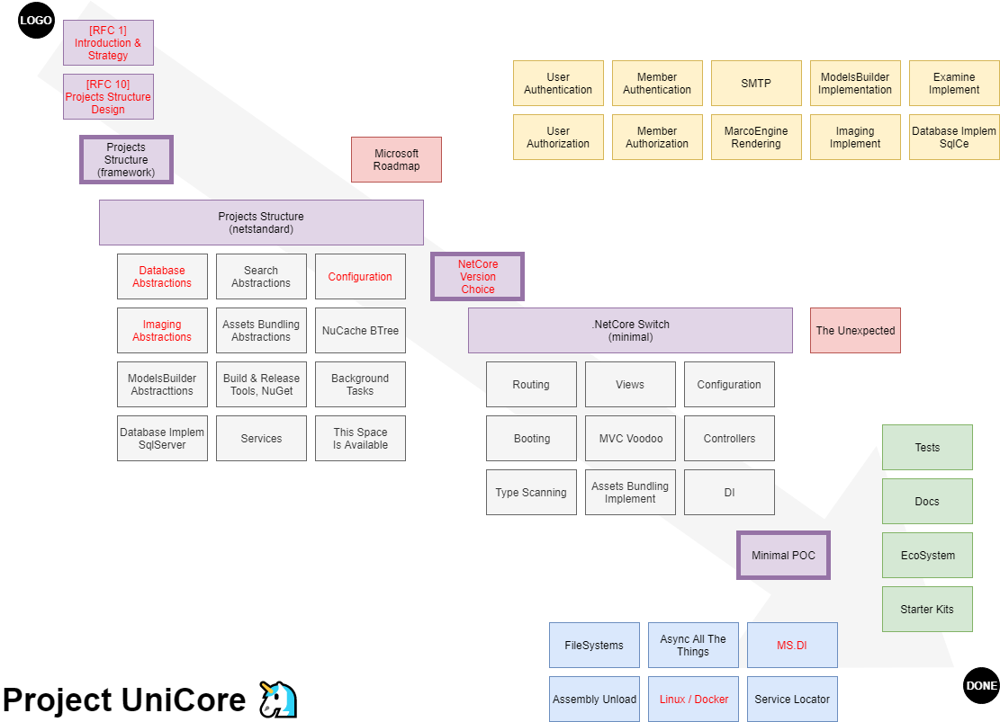

# Project UniCore 🦄

Request for Contribution (RFC) 1 : _Introduction & Strategy_

## Code of conduct

Please read and respect the [RFC Code of Conduct](https://github.com/umbraco/rfcs/blob/master/CODE_OF_CONDUCT.md)

## Intended Audience

The intended audience for this RFC is technical users and developers.

## Summary

Title: Project UniCore

We would like to proceed with moving the current Umbraco codebase from .Net Framework to be based on .Net Core. 

We would like to make the porting of this code as simple as possible, both from the point of view of the engineers 
but more importantly the point of view of Umbraco end-users/developers. 

Where possible, we hope to create a .Net Core build of Umbraco while keeping as many of the same 
existing APIs and paradigms that developers are currently used to.

We are calling this the “Minimal disruption” approach.

## Motivation

Currently Umbraco runs on ASP.Net Framework which is a technology that is not in actively enhanced by 
Microsoft. .Net Core is the default platform recommended by Microsoft and is the platform that Microsoft 
will continue to evolve into the future, therefore, it is the obvious platform for Umbraco to move to.

The motivation for the “Minimal disruption” approach is:

For the benefit of Umbraco end-users, developers, contributors and Umbraco HQ, we want to make 
the development process for this transition as simple and short as possible. This means we would 
like to keep any changes to the current concepts in Umbraco to a minimum. We want to make the 
transition from the current .Net Framework version of Umbraco to a .Net Core version of Umbraco 
as frictionless as possible.

## Detailed Design

The “Project UniCore” title is a code name for this project since we do not want to explicitly affiliate 
this project with an Umbraco numbered release. 

There will be future RFCs ready when certain milestones are ready. See the “Related RFCs” section at 
the end of this document. 

### Critical Path diagram

---

---

*   The diagonal (top left to bottom right) is the “Critical Path” that will be taken to get to a .Net Core build. 
*    Purple: Main components of the “Critical Path”
*    Grey: Sub modules of the main components (subject to change)
*    Red text: means that those will be RFCs that will be released when those milestones are ready
*    Red box: Areas of risk that may affect the timeline
*    Yellow: Areas that will be abstracted initially during the main phase of porting the project to .Net Core. 
Once the .Net Core switch milestone is ready to start, these areas will need to be developed in parallel with 
the “Critical Path”. The development of these areas should only be commenced with the 
consultation of Umbraco core development team.
*    Blue: Out of scope for “Project UniCore”. Candidates for successive projects.flag
*    Green: Considerations for pre-launch of the Umbraco .Net Core build (i.e. ecosystem) 

### Other

*   The next RFC is the “Project structure design” which will contain the details about how we plan 
to get to the “.Net Core Switch” milestone
*   The final result of the “Minimal disruption” approach with regards to moving from the current .Net 
Framework version of Umbraco to a .Net Core version of Umbraco is that developers will be able to migrate 
their projects. The database will be able to be upgraded the same way as it is today. The solution 
will need to be migrated from .Net Framework projects to .Net Core projects and the existing code 
will need to be updated to support any breaking changes. Breaking changes will exist due to the ASP.Net 
change from .Net Framework to .Net Core and also for any necessary changes needed by the 
Umbraco .Net Core transition.
*   Namespace changes in the Umbraco solution will be made. Although this is a breaking change we feel 
that this is easily overcome by a textual find + replace. 
*   Documentation will be provided on how to transition to the Umbraco .Net Core version including 
what breaking changes exist and how to overcome the common changes.

## Drawbacks

Breaking changes are unavoidable when moving from the current .Net Framework of Umbraco to the .Net 
Core version of Umbraco. The primary purpose of this RFC is to show that we want to minimize these 
breaking changes where possible.

## Alternatives

1. The alternative to “Minimal disruption” approach is that we re-architect the majority of the 
Umbraco solution which would yield very large breaking changes and make the transition to this 
new version much more difficult and time consuming. There would be benefits of re-architecting 
large parts of the solution which would mean a cleaner Umbraco solution but we feel it’s more 
important to get to a .Net Core build faster and then make further architectural changes and 
enhancements in later versions.
2. Not changing namespaces at all. This will make the development flow more difficult. We also feel 
that it’s a necessary stepping stone with minimal impact to move towards a cleaner solution in the future.
3. Don’t move to .Net Core. We don’t feel that this is a viable option for a sustainable future of the Umbraco CMS.

## Out of Scope

*   Architectural changes and features that are not part of the “Critical Path” (including but not limited to Blue items)

## Unresolved Issues

The answers that we are hoping to get from the community is:

*   Is this approach understandable?
*   Are there aspects of this approach missing?
*   Do you agree with the “Minimal disruption” approach? If not, why?

## Related RFCs (where are we in roadmap?)

*   RFC - Introduction & Strategy
    *   RFC - Project/solution restructure
    *   RFC - Database abstraction
    *   RFC - Imaging abstraction
    *   RFC - Configuration
    *   RFC - .Net Core Version choice
    *   RFC - Microsoft DI transition
    *   RFC - Linux / Docker

## Contributors

This RFC was compiled by:

*   Shannon Deminick (Umbraco HQ)
*   Carole Logan (Umbraco Community)
*   Lars-Erik Aabech (Umbraco Community)
*   Stéphane Gay (Umbraco HQ)
*   Bjarke Berg (Umbraco HQ)
*   Umbraco 2019 Retreat members
