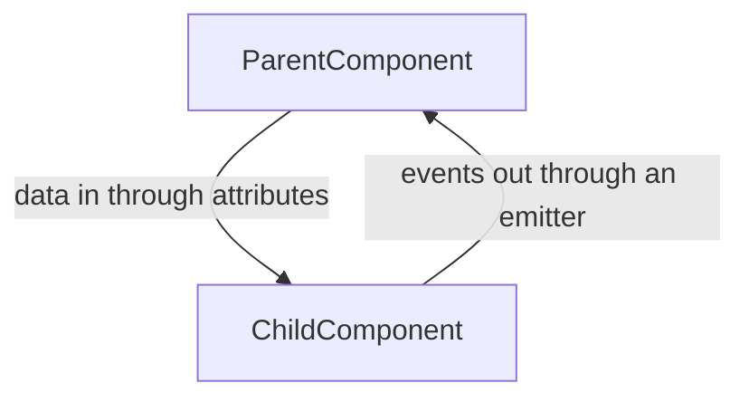

# Implement The New Backoffice

### Request for Comments (RFC) 0024: Implement The New Backoffice

## Code of Conduct

Please read and respect the [RFC Code of Conduct](https://github.com/umbraco/rfcs/blob/master/CODE_OF_CONDUCT.md).

## Intended Audience

The intended audience for this RFC is

- Technical users
- Developers
- Extension developers
- Package authors

## Summary

To future-proof Umbraco’s backoffice, we intend to run a three-part process - each with an RFC:

1. Standalone UI Component library (RFC accepted January 2021)
2. Defining backoffice extension API (RFC accepted December 2021)
3. Implement the new backoffice (This RFC)

It can be helpful to watch this [umbracoCoffee episode](https://youtu.be/i0QfgRYj0zQ?t=1681) where Filip Bruun Bech-Larsen, CTO for Umbraco, introduces the concept.

## Motivation

Umbraco’s backoffice is a big reason why editors AND developers choose Umbraco. It is easy to use and flexible to customize to the specific needs of a project/client

The current (second) generation backoffice is built using AngularJS. It was a great choice in 2013, and has served us well, but has long been considered outdated. Since December 31, 2021, AngularJS has reached its [end-of-life state](https://blog.angular.io/discontinued-long-term-support-for-angularjs-cc066b82e65a).

Since 2012 we have learned a lot about building a complex Single Page Application (SPA). The current situation does not allow us (or makes it hard) to fix things we have done inherently wrong. The current state is holding development - and excitement - back.

With the next generation of Umbraco’s backoffice, we want to bring several benefits to Umbraco, namely:

- Speed up the maintenance and future development of the backoffice for Umbraco HQ and community developers alike
- The code will utilize TypeScript and accompanying types in the high-seat
- 3rd-party integrations will be considered as first-class citizens
- Make Umbraco more attractive for new contributors, by using modern technology and methodology - thereby also making it easier to contribute
- Simplify and speed up work for developers and package authors, by enhancing the ability to create great UI/UX
- Streamline the experience throughout the entire journey incl. 1st- and 3rd-party packages, Cloud, etc.
- Reuse work across our products for less development but also for improvements to be distributed
- Maintain market leadership in a customizable editing experience (tailored to clients)

## Detailed Design

### Building the application

#### Single-Page Application

As with the old backoffice, the new backoffice will be built as a single-page application. In addition to being served solely in the browser, the new backoffice will also be built as a true standalone application meaning that it can be hosted anywhere since it only requires a browser and a file host to run. No server-side rendering will be required to run the backoffice application.

#### Routing

In single-page applications routing is usually a non-trivial area. We are looking into what routers are available at the moment. We need something for the application that can handle both top-level routing and deep-level nesting so that each section, content app, infinite editor, tab, and so on, can push a state to either the URL, the browser history, or both. It should also be possible for any frontend extension to register its own set of routes enabling anyone to deep-link into an extension subarea.

#### Web Components

We are going to use a standards-based way to build our custom UI as close to modern browser conventions and technology as possible. We have considered many options - libraries and frameworks alike - and have concluded that we would like to avoid falling into another technical grave in the years to come when what we choose now becomes obsolete.

> _When you're working with the browser rather than against it, code, skills, and knowledge remain relevant for a longer time. Development becomes faster and debugging is easier because there are fewer layers of abstractions involved._ > _— [modern-web.dev](https://modern-web.dev/discover/about/)_

We have a firm belief that sticking with the browser standards will continue to evolve and benefit us in the years to come. Therefore we have chosen to build the new backoffice UI with [Web Components](https://developer.mozilla.org/en-US/docs/Web/Web_Components).

JavaScript frameworks are all doing essentially the same thing: Producing custom elements with syntactic sugar, and also added benefits of having built-in routers, state machines, and stores. The concept of Web Components is created such that the browsers natively support all the things we love from libraries such as React and Vue including having custom elements, reactivity, and state. It allows us to create the most optimal setup and environment for the backoffice to ship modern, slim, chunked modules for the UI. It also allows us to choose whatever libraries we like for state management, routing, and observability.

Building our software with Web Components - a native web standard - ensures that our software works and will keep working for at least a longer period than any external library will. The APIs will keep getting updated along with the browser itself, patching any security vulnerability along the way.

##### Boilerplating

Web Components require a lot of boilerplate in their current state, so to speed up development, we are going to work with a very efficient, [tiny library called Lit](https://lit.dev/). This library has helped us tremendously in building the [Umbraco UI Library](https://github.com/umbraco/Umbraco.UI) and is also now serving parts of the [Umbraco Cloud portal](https://umbraco.com/products/umbraco-cloud/). Choosing Lit also has the added benefit of being able to share tech and collaborate throughout Umbraco HQ.

A component for the new backoffice can be built with only a few lines of code:

```ts
import { html, css, LitElement } from "lit";
import { customElement, property } from "lit/decorators.js";

@customElement("my-simple-greeting")
export class SimpleGreeting extends LitElement {
  static styles = css`
    p {
      color: blue;
    }
  `;

  @property()
  name = "Somebody";

  render() {
    return html`<p>Hello, ${this.name}!</p>`;
  }
}
```

Incidentally, Web Components and Lit take care of most of the stuff we know from AngularJS, such as the concept of "components" and data binding. Running through a data set is fairly easy with Lit's template interpolation with native JavaScript, we can accomplish this in a much cleaner way than AngularJS ever did, where you had two-way data binding. Two-way data binding is, however, something that only AngularJS supported and is not something you would use today. Instead, the flow would be: input = data, output = events.



Although we have chosen Lit and TypeScript to build the new backoffice, developers are free to use any framework and libraries of their choice to implement backoffice extensions. We will be building an extension API that is framework agnostic as stated in an [earlier RFC](https://github.com/umbraco/rfcs/blob/main/cms/0023-define-the-backoffice-extension-api.md#detailed-design).

Please have a look at [Lit’s excellent playground](https://lit.dev/playground/) to learn more about it.

#### Umbraco UI Library

We have built a UI Library that will serve as a great base for the backoffice (and some of our other products). Using the Umbraco UI Library provides us with custom-made components needed for the backoffice UI. This means the code for composing UI will be as little as possible. Additionally, we can extend components of the UI Library to make special parts for the backoffice or extensions.

#### Build setup

A lot of tools come with the territory when building a modern web application. With the choice of Lit and TypeScript, we need something to help us compile/transpile TypeScript code, bundle everything together in small chunks, and remove any code that is not in use from libraries, etc.

Many setups exist today with support for Lit and TypeScript. We especially like the premise of [esbuild](https://esbuild.github.io/) to transpile the code due to its swiftness and lightness. For tree shaking and splitting, we like what [Rollup](https://rollupjs.org/) has done in terms of supporting esbuild. However, managing the configuration of these and keeping them up-to-date is not a task that we want to spend too much time on. Therefore we have chosen to use [Vite.js](https://vitejs.dev/) to handle everything related to the development and build processes, including running the entire application in a development mode when building it as well as creating the production build. Vite uses Rollup underneath the surface and it also exposes the underlying configuration if we need to change something, but all-in-all it abstracts the whole process away to ensure that we are always running the most optimal setup.

The development flow of the new backoffice will simply consist of cloning down the repository, installing the npm dependencies, running Vite, and a browser will launch immediately supporting live reload and debugging:

```bash
git clone ​​git@github.com:umbraco/Umbraco.CMS.Backoffice.git
cd Umbraco.CMS.Backoffice
npm install
npm run dev
```

### Extension API

With the old backoffice, it was possible to expose the entire AngularJS API globally enabling extension developers to not only use built-in components but also create their own on the same runtime as the backoffice. In addition to AngularJS, we also ship the old backoffice with other globals such as Underscore, jQuery, SignalR, and many more.

With modern web development, it is customary to run the code through both a minification and a tree-shaking process and even split the code into chunks to avoid loading the entire application initially. This process also puts all dependencies into their own scope, preventing them from leaking and/or being used outside by other bundles such as extensions loaded dynamically unless the dependencies are specifically exposed.

Initially, we will not expose anything, because the combined bundled versions of our tools like Lit and others are rather large and do not necessarily support being exposed at all. This means that extensions will not be able to hook onto most of the underlying libraries of the backoffice. Instead, extensions will have to provide their dependencies and run them through a tree-shaking process with tools like Rollup. However, we are looking to see if some tools could benefit from being provided globally - provided that they come with a universal module that runs in the browser. We expect that the overhead of overlapping dependencies between the backoffice and extensions will be very small, but a lot of upcoming features such as [import maps](https://github.com/WICG/import-maps) will be interesting to look into to solve that particular drawback.

The recommendation to extension developers is that they also choose Lit and TypeScript. To help them do all of that, we are planning to release a helper tool that will allow developers to start building extensions against the new extension API. The tool will bootstrap their development in such a way that they get up and running very quickly and can start writing code.

There are several ways to go about building extensions for the new backoffice and this tool will cover a few ways of doing so, both for developers wanting to start with TypeScript and Lit, and for those wanting to start with HTML and vanilla JavaScript. The tool could come in the form of either a dotnet template (adding to [the existing templates](https://www.nuget.org/packages/Umbraco.Templates)) or an npm package, and could be invoked like this:

**Dotnet:**

```bash
dotnet new --install Umbraco.Templates
dotnet new umbracopackage --name MyPropertyEditor --type propertyeditor
```

**NPM:**

```bash
npm create @umbraco/package --name MyPropertyEditor --type propertyeditor
```

#### Typings

The new backoffice will ship with [TypeScript declaration files](https://www.typescriptlang.org/docs/handbook/declaration-files/templates/module-d-ts.html), either physically or in a [Definitely Typed](https://github.com/DefinitelyTyped/DefinitelyTyped) package, for all relevant components enabling TypeScript as a first-class citizen for Web API interaction with both request and response types, JavaScript runtime services through the Context API, Umbraco backoffice components and UI Library components.

#### Context API

To provide contextual shared logic we have established a system called Context API. This is an event-based protocol that components can use to retrieve context from any location in the DOM. A context is an instance of a class that is provided to a certain scope of the DOM.

The Context API consists of two parts: A Context Provider and a Context Consumer.

The following example shows how to provide context (in this instance it is a service) for other components to consume:

```ts
import { UmbContextProviderMixin } from "@umbraco/context";

// Create a class that extends from the context PROVIDER mixin, which gives you access to the provideContext method
class UmbAppElement extends UmbContextProviderMixin(HTMLElement) {
  constructor() {
    super();

    // Provide anything you like here and send it downstream in the DOM tree
    this.provideContext("myContextAPIService", new MyContextAPIService());
  }
}
```

And the context service is then requested through the consumer, which has a handy mixin to extend the component from:

```ts
import { UmbContextConsumerMixin } from "@umbraco/context";

// Create a class that extends from the context CONSUMER mixin, which gives you the consumeContext method
class UmbMyElement extends UmbContextConsumerMixin(HTMLElement) {
  constructor() {
    super();

    // Request anything you like here such as the myContextAPIService that was provided above
    this.consumeContext("myContextAPIService", (api) => {
      const myContextApi = api;

      // Invoke a method on the provided service
      myContextApi.fooBar();
    });
  }
}
```

#### Styling

We recommend initiating Web Components with ShadowDOM, and this is always the case when using Lit.

ShadowDOM encapsulates the insides of a Web Component which means no CSS classes will be available nor will any of the styling interfere with the backoffice.

Style selectors can be much simpler and separated for each component. The styling (CSS) of a Web Component is provided inline in the JavaScript code by a static `styles` property:

```ts
import { LitElement, css, html } from "lit";

export class MyStylingExampleElement extends LitElement {
  static styles = css`
    p {
      color: darkgrey;
    }
    div {
      border: 1px solid green;
      color: green;
      padding: 6px;
    }
  `;

  render() {
    return html`
      <p>Hello world</p>
      <div>My styles are just for my template</div>
      <uui-button look="primary" color="positive"
        >This component contains its own styling</uui-button
      >
    `;
  }
}
```

The Umbraco UI Library will be available for extensions and this lays the foundation for the UI of extensions. If the available UI components do not cover the specific needs on their own, then styling can be based on the CSS Custom Properties provided by the UI Library (example: `--uui-color-text`)

Read more about the currently available custom properties here: [Sizing Custom-Properties](https://uui.umbraco.com/?path=/story/design-custom-properties--sizing) and [Color Custom-Properties](https://uui.umbraco.com/?path=/story/design-custom-properties--interface-colors)

Using the provided CSS Custom Properties will ensure that the UI looks right cascading down in the DOM without affecting any backoffice UI:

```ts
import { LitElement, css, html } from "lit";

export class MyStylingExampleElement extends LitElement {
  static styles = css`
    p {
      color: var(--uui-color-text-alt);
    }
    div {
      border: 1px solid var(--uui-color-positive-standalone);
      color: var(--uui-color-positive-standalone);
      padding: var(--uui-size-space-2);
    }
  `;

  render() {
    return html`
      <p>Hello world</p>
      <div>My styles are just for my template</div>
      <uui-button look="primary" color="positive"
        >This component contains its own styling</uui-button
      >
    `;
  }
}
```

We recommend using Web Components with ShadowDOM for each component of your extension. Extension developers are free to structure their extensions as desired, and as long as the root element uses a ShadowDOM you can use any tech of choice.

### Backoffice Web API

We are taking the opportunity to create new controllers for the web API during this project. In recent years, a lot of business logic has been moved to a service layer in the backend of Umbraco CMS making the controllers focus only on authentication and creating models around the data.

#### Authentication

The controllers for the old backoffice relied on cookie authentication, but this is quickly becoming outdated and can be problematic in a multi-tenancy setup where the backoffice frontend and server do not use the same hostname. We want to adopt the OAuth 2.0 protocol with OpenID Connect for authentication and authorization beginning with the new backoffice. This approach will also allow server-to-server authentication down the road using app tokens and/or having a concept of authorized apps.

#### Taking a schema-first approach

When rewriting all the controllers, it is also the perfect time to adopt another paradigm: Schema-first. For each endpoint and model, we are going to describe it in an OpenAPI 3.0 schema (sometimes also known as Swagger) first before implementing it using commonly available tools for the .NET backend and the TypeScript frontend.

This becomes especially handy for TypeScript, where it will allow us to swiftly convert the schema to several interfaces and then using something like [openapi-typescript-fetch](https://github.com/ajaishankar/openapi-typescript-fetch#readme), we can quickly set up fetchers for getting the data in a type-safe way:

```ts
import { paths } from "./schema";
import { Fetcher } from "openapi-typescript-fetch";

// First we generate a HTTP fetcher (using Fetch) from the generated schema
const fetcher = Fetcher.for<paths>();

// We assign one of the paths (content-by-id) to a constant which makes it type-strong
const getContentById = fetcher.path("/content/{id}").method("get").create();

// Try and get the data (error codes are not thrown as exceptions but will have to be read from the response
try {
  const { data } = await getContentById({ id: 1 });

  // If the data is truthy we know we got the content
  if (data) {
    console.log("node", data);

    // If the data is not truthy perhaps the data did not exist
  } else {
    console.log("node does not exist");
  }

  // If we land in the catcher, something went wrong with the connection or perhaps the endpoint did not exist
} catch (e) {
  console.log("error", e);
}
```

### Documentation

Documentation for the new backoffice should be explorative, interactive, and as much as possible auto-generated. We want to provide a combined backoffice and UI Library documentation to enable developers to find the relevant details of interest with ease. Therefore we will use Storybook just as the UI Library does, enabling us to merge the two and present combined documentation for the backoffice.

The documentation should be versioned so users can get the documentation for the specific version of interest. This will replace what we today know as [ApiDocs](https://apidocs.umbraco.com/v9/ui#/api).

All frontend-related documentation on [our.umbraco.com](https://our.umbraco.com/documentation/) will have to be rewritten. Ideally, code examples will originate from backoffice documentation and thereby be auto-generated.

### Testing

It should be as simple as issuing the command `npm test` to run all tests, and there is going to be a way to get test coverage reports in various formats.

The old backoffice has a set of unit tests using Karma and a set of acceptance tests using Cypress for the UI. The acceptance tests for the old backoffice will be converted to [Playwright](https://playwright.dev/) in the future and we will try to transfer that work to the new backoffice project, and use it for both unit and end-to-end testing.

Traditional tools are not designed for piercing the Shadow DOM of Web Components, but this is where Playwright becomes especially handy since it by default looks through an arbitrary number of open shadow roots when selecting elements.

### Security & Updates

Security is an ever present thing to consider: Any external library that we install must be maintained and updated regularly whenever a security patch is released following a CVE or otherwise. This is more easily done on an auto-updated product such as a SaaS product, but with Umbraco CMS being an installed product, we do not have that luxury. As an example, Umbraco 7 was released in 2013 using the new-at-the-time AngularJS framework. This framework is now considered end-of-life as of January 2022 and will no longer receive updates.

We will strive to maintain the security of the backoffice and the UI Library by using tools such as GitHub's Dependabot to automatically keep the backoffice and UI Library up to date and [CodeQL](https://codeql.github.com/) to catch low-hanging fruit before any code is merged. We will also try to lock down the versions of the various third-party libraries to a specific version so that we may vet any updates before they are applied.

## Moving forward

### What is going to happen?

The new backoffice will be shipped in a major version of Umbraco CMS as yet to be determined and the old backoffice will be marked as deprecated in the major version leading up to that one.

### GitHub

The development of the new backoffice will happen in its own GitHub repository to not pollute the main repository of the CMS. This allows us to make sure that we separate all concerns from the backend/C# code. The repository will be made open to the public allowing everyone to follow the project from infancy to completion. When it is finished, we will include it in Umbraco CMS either as seen today, where it is simply included as a web project, or it will be installed during the build step as a submodule or downloaded from somewhere like NuGet.

### Property editors and data types

There are a lot of Property Editors and Data Types built into the old backoffice. Most of these will be migrated to the new backoffice using the same aliases.

#### Media Picker (Legacy)

The Media Picker Property Editor has been marked as legacy/deprecated for some time and this editor will not be migrated to the new backoffice. Instead, the new Media Picker, [introduced in Umbraco 8.14](https://umbraco.com/blog/umbraco-814-release/#mediapicker), will be the only one available.

#### Nested Content

We do not plan to migrate the Nested Content Property Editor to the new backoffice because the Block List editor supports similar data structures and editing experience. We expect that Nested Content will be marked as a legacy in one of the upcoming major versions of the CMS. Instead, we will see if and how the Block List type can be improved going forward.

#### Grid Layout

We do not plan to migrate the Grid Layout Property Editor. The future of Umbraco points towards using Element Types (just like the Block List Property Editor) and the Grid Layout editor does not support this natively. We are currently investigating what a new block-based grid editor will look like.

#### Pre-Configured Data Types

There are a lot of different Data Types in the old backoffice, and frankly, some of them have been unused for a long time. We are going to comb through the existing ones during this project to see what makes sense to have in the new backoffice.

## Drawbacks

This will be a complete breaking change of the backoffice as a piece of software. It will also disrupt all existing packages that add backoffice elements. They will need to update to the new extension API as discussed with the [RFC #0023](https://github.com/umbraco/rfcs/blob/main/cms/0023-define-the-backoffice-extension-api.md), and they will have to update the UI to use the Umbraco UI Library.

## Alternatives

The main problem to solve is to remove AngularJS. Angular provides something called [Angular Upgrade](https://angular.io/guide/upgrade) which is very extensive. However, upgrading to modern Angular will still give us all of the drawbacks and will not satisfy the wish to become independent of any framework.

Being independent of any one framework leaves out the possibility of choosing one of the major players in the market such as React or Vue. However, extension developers are free to choose whatever they feel comfortable with for adding functionality to the backoffice.

A big part of this project is also to reduce and minimize technical debt; a lot of the existing functionality is either duplicated multiple times or written into a service loop where some of the existing AngularJS services do not make sense to have anymore. There is also a varying degree of quality to the existing components in terms of documentation, usability, and accessibility.

Other alternatives were discussed in [the original RFC for future-proofing the backoffice](https://github.com/umbraco/rfcs/blob/main/cms/0021-future-proofing-the-umbraco-backoffice.md#alternatives).

## Out of Scope

New Web API controllers will be made available for the new backoffice, however, any technological change on how to build a Web API will be considered out of scope for this RFC and in general, any backend changes to facilitate the new backoffice is out of scope.

## Proof of Concept

We have built a proof-of-concept application along with this RFC. The application can be installed and run on your machine, and you can read the source code freely. The application demonstrates a few things on how to implement the backoffice, namely:

- How we expect to build the web application
- How we expect to run a test suite
- What is the structure of the application like
- How we expect to handle contexts inside the application
- How we expect extensions to interact with the backoffice and its contexts

[Check out the dedicated repository right away to get started](https://github.com/umbraco/Umbraco.Backoffice.POC).

## Related RFCs

[#0021 - Future-proofing the backoffice](https://github.com/umbraco/rfcs/blob/main/cms/0021-future-proofing-the-umbraco-backoffice.md)

[#0022 - UI library](https://github.com/umbraco/rfcs/blob/main/cms/0022-ui-library.md)

[#0023 - Defining the backoffice extension API ](https://github.com/umbraco/rfcs/blob/main/cms/0023-define-the-backoffice-extension-api.md)

## Contributors

This RFC was compiled by:

- Jacob Overgaard (Umbraco HQ)
- Mads Rasmussen (Umbraco HQ)
- Niels Lyngsø (Umbraco HQ)
- Jesper Møller Jensen (Umbraco HQ)
- Filip Bruun Bech-Larsen (Umbraco HQ)
- Kenn Jacobsen (Backoffice Community Team)
- Laura Weatherhead (Backoffice Community Team)
- Lee Kelleher (Backoffice Community Team)
- Maud Langaskens (Backoffice Community Team)
- Matt Sutherland (Backoffice Community Team)
- Blake Watt (Backoffice Community Team)
